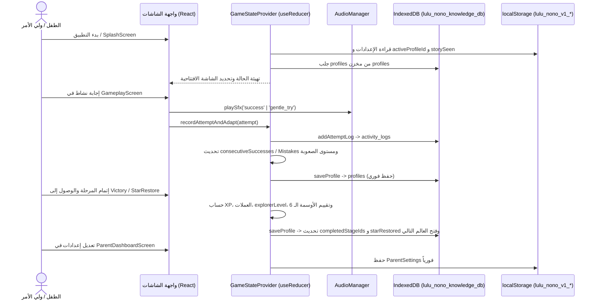

# مخطط تدفق البيانات والتخزين — DATA FLOW DIAGRAM

```mermaid
sequenceDiagram
    actor Child as الطفل / ولي الأمر
    participant UI as واجهة الشاشات (React)
    participant Store as GameStateProvider (useReducer)
    participant Audio as AudioManager
    participant IDB as IndexedDB (lulu_nono_knowledge_db)
    participant LS as localStorage (lulu_nono_v1_*)

    Child->>UI: بدء التطبيق / SplashScreen
    Store->>LS: قراءة الإعدادات و activeProfileId و storySeen
    Store->>IDB: جلب profiles من مخزن profiles
    Store-->>UI: تهيئة الحالة وتحديد الشاشة الافتتاحية

    Child->>UI: إجابة نشاط في GameplayScreen
    UI->>Audio: playSfx('success' | 'gentle_try')
    UI->>Store: recordAttemptAndAdapt(attempt)
    Store->>IDB: addAttemptLog -> activity_logs
    Store->>Store: تحديث consecutiveSuccesses / Mistakes ومستوى الصعوبة
    Store->>IDB: saveProfile -> profiles (حفظ فوري)

    Child->>UI: إتمام المرحلة والوصول إلى Victory / StarRestore
    Store->>Store: حساب XP، العملات، explorerLevel، وتقييم الأوسمة الـ 6
    Store->>IDB: saveProfile -> تحديث completedStageIds و starRestored وفتح العالم التالي

    Child->>UI: تعديل إعدادات في ParentDashboardScreen
    Store->>LS: حفظ ParentSettings فورياً
```
