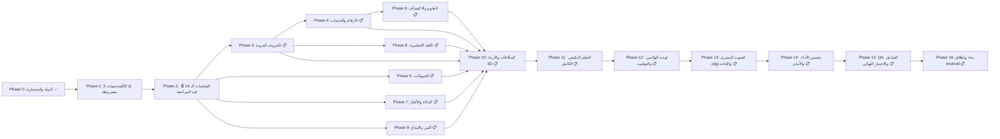

# مخطط اعتماديات المراحل — PHASE DEPENDENCIES DIAGRAM

```mermaid
flowchart LR
    P0["Phase 0: البيئة والمعمارية ✅"] --> P1["Phase 1: الشخصيات 3D ⚠️ مشروطة"]
    P1 --> P2["Phase 2: الشاشات الـ 14 ⏳ قيد المراجعة"]

    P2 --> P3["Phase 3: الحروف العربية 📋"]
    P2 --> P5["Phase 5: الحيوانات 📋"]
    P2 --> P7["Phase 7: الذكاء والألغاز 📋"]
    P2 --> P9["Phase 9: الفن والإبداع 📋"]

    P3 --> P4["Phase 4: الأرقام والحساب 📋"]
    P3 --> P8["Phase 8: اللغة الإنجليزية 📋"]
    P4 --> P6["Phase 6: العلوم والاكتشاف 📋"]

    P3 & P4 & P5 & P6 & P7 & P8 & P9 --> P10["Phase 10: المكافآت والأزياء 3D 📋"]
    P10 --> P11["Phase 11: التعلم التكيفي الكامل 📋"]
    P11 --> P12["Phase 12: لوحة الوالدين والتوقيت 📋"]
    P12 --> P13["Phase 13: الصوت البشري .ogg والإتاحة 📋"]
    P13 --> P14["Phase 14: تحسين الأداء والأمان 📋"]
    P14 --> P15["Phase 15: QA الشامل والاختبار النهائي 📋"]
    P15 --> P16["Phase 16: بناء وإطلاق Android 📋"]
```
