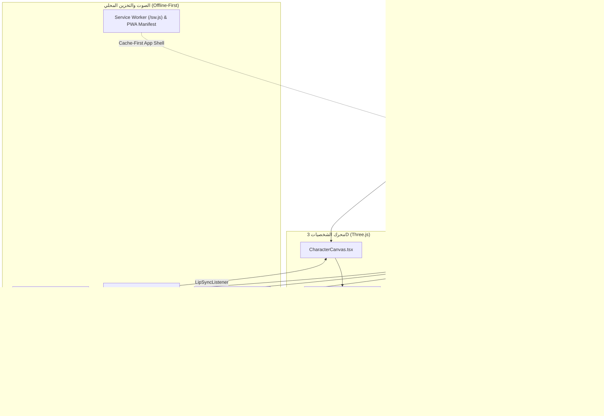

# مخطط نظرة عامة على النظام — SYSTEM OVERVIEW DIAGRAM

```mermaid
flowchart TB
    subgraph UI["طبقة الواجهات والـ 14 شاشة (React 19 + Tailwind RTL)"]
        S1["Splash / WelcomeStory / CreateProfile"]
        S2["Home / WorldMap / WorldDetails / StageSelect"]
        S3["Gameplay / Victory / StarRestore"]
        S4["Rewards / Profile / ParentGate / ParentDashboard"]
    end

    subgraph Core["النواة وإدارة الحالة"]
        Store["GameStateProvider (src/state/gameStore.tsx)"]
        Router["Navigation Guards (src/navigation/screenRouter.ts)"]
        Reg["World Registry (src/registry/worldRegistry.ts)"]
        Perf["WebGL Profiler (src/utils/performanceProfile.ts)"]
    end

    subgraph Engine3D["محرك الشخصيات 3D (Three.js)"]
        Canvas["CharacterCanvas.tsx"]
        Ctrl["CharacterController (Lulu & Nono)"]
        Anim["Animation & Expression & Interaction Managers"]
        Models["LuluModel.ts & NonoModel.ts + Lighting/Materials"]
    end

    subgraph Platform["الصوت والتخزين المحلي (Offline-First)"]
        Audio["AudioManager (Web Audio API) + VoiceManifest"]
        IDB["IndexedDB (profiles, activity_logs, drawings, asset_cache)"]
        LS["localStorage (settings, active_profile, story_seen)"]
        SW["Service Worker (/sw.js) & PWA Manifest"]
    end

    UI --> Store
    Store <--> Router
    Store <--> Reg
    UI --> Perf
    UI --> Canvas
    Canvas --> Ctrl --> Anim --> Models
    Canvas <-->|"LipSyncListener"| Audio
    Store --> Audio
    Store <--> IDB
    Store <--> LS
    SW -.->|"Cache-First App Shell"| UI
```
