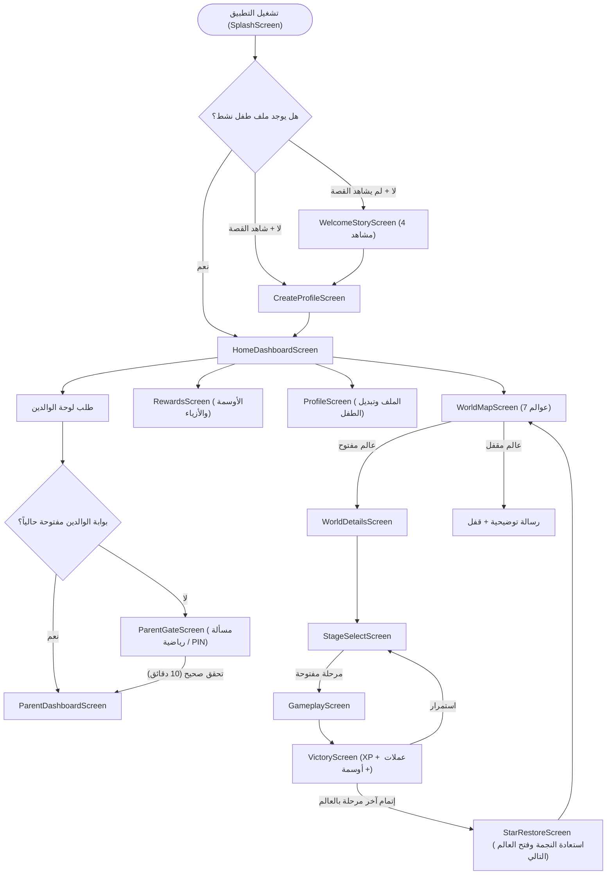

# مخطط تدفق المستخدم — USER FLOW DIAGRAM

```mermaid
flowchart TD
    Start(["تشغيل التطبيق (SplashScreen)"]) --> CheckProfile{"هل يوجد ملف طفل نشط؟"}
    CheckProfile -->|"لا + لم يشاهد القصة"| Story["WelcomeStoryScreen (4 مشاهد)"]
    CheckProfile -->|"لا + شاهد القصة"| Create["CreateProfileScreen"]
    CheckProfile -->|"نعم"| Home["HomeDashboardScreen"]

    Story --> Create --> Home

    Home --> Map["WorldMapScreen (7 عوالم)"]
    Home --> Rewards["RewardsScreen (الأوسمة والأزياء)"]
    Home --> Profile["ProfileScreen (الملف وتبديل الطفل)"]
    Home --> GateReq["طلب لوحة الوالدين"]

    GateReq --> GateCheck{"بوابة الوالدين مفتوحة حالياً؟"}
    GateCheck -->|"لا"| ParentGate["ParentGateScreen (مسألة رياضية / PIN)"]
    GateCheck -->|"نعم"| ParentDash["ParentDashboardScreen"]
    ParentGate -->|"تحقق صحيح (10 دقائق)"| ParentDash

    Map -->|"عالم مفتوح"| WDetails["WorldDetailsScreen"]
    Map -->|"عالم مقفل"| LockedMsg["رسالة توضيحية + قفل"]
    WDetails --> StageSel["StageSelectScreen"]
    StageSel -->|"مرحلة مفتوحة"| Play["GameplayScreen"]
    Play --> Victory["VictoryScreen (XP + عملات + أوسمة)"]
    Victory -->|"إتمام آخر مرحلة بالعالم"| Star["StarRestoreScreen (استعادة النجمة وفتح العالم التالي)"]
    Victory -->|"استمرار"| StageSel
    Star --> Map
```
